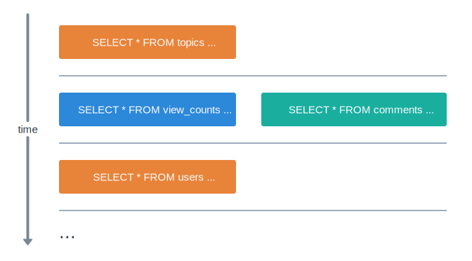

# Loaders and Custom Batching

One of the key features of Ent Framework is a holistic [n+1-selects-solution.md](../getting-started/n+1-selects-solution.md "mention"). When you address a single row in the database (read or write), the engine batches that calls into compound SQL queries, which allows to save a lot on round trip time.

The core of that idea lies in Meta's [DataLoader](https://github.com/graphql/dataloader) pattern, which initially was invented for just one case: loading an object by its ID. Ent Framework generalizes DataLoader to _all_ read and write operations.

In Ent Framework, this layer of abstraction is called Loader. It's an advanced concept. You'll rarely need to create your own Loaders, but once you do, your Loader will inevitably appear on the critical path of your app, since it's a performance optimization pattern.

## Node Event Loop

Event loop, Promises and I/O in Node are complicated topics with many nuances, best described in the [official documentation](https://nodejs.org/en/learn/asynchronous-work/event-loop-timers-and-nexttick).

Here, we'll only give a rough and inprecise overview, enough to understand the Loader abstraction better.

Event loop consists of multiple "phases", each phase is a sequence of Macrotasks, and after each macrotask, all pending Microtasks are executed.&#x20;

1. In every phase, Node first picks the oldest pending macrotask (like callbacks waiting for I/O results, timers etc.).&#x20;
2. Then, once the macrotask finishes, it run the pending microtasks (like `Promise#then()` invocations or callbacks scheduled with `process.nextTick()`), until there are no more microtasks pending.
3. Microtasks may schedule new macrotasks (for the next phase or the next spin) of new microtasks (for the same phase), and then eventually it all starts from the beginning.

The main idea behind Loader is to accumulate all Ent Framework calls (like `loadX()`, `insert()` etc.) within one microtasks block, group them together and then flush as one large SQL query towards the resolution in the next macrotask I/O processing. Only the calls of the same type are batched together (e.g. load with load, insert with insert); the calls of different types relate to independent I/O macrotasks, and thus, almost always resolve in different microtask blocks.

<figure><figcaption></figcaption></figure>

## Simple Loader Example

Loader class allows you to build your own batching logic, for the cases when Ent Framework internal batching is not enough.

Let's first build a very simple Loader, similar to what the built-in `loadNullable()` uses internally.

```typescript
class TopicSimpleLoader {
  private ids = new Set<string>();
  private results = new Map<string, EntTopic>();

  constructor(private vc: VC) {}

  onCollect(id: string): void {
    this.ids.add(id);
  }

  async onFlush(): Promise<void> {
    const topics = await EntTopic.select(
      this.vc,
      { id: [...this.ids] },
      Number.MAX_SAFE_INTEGER, // limit
    );
    for (const topics of topic) {
      this.results.set(topic.id, topic);
    }
  }
  
  onReturn(id: string): EntTopic | null {
    return this.results.get(id) ?? null;
  }
}
```

The main beauty of Loaders is that your code still looks like you're working with single objects (or sincle IDs), not with lists:

```typescript
async function getTopic(vc: VC, id: string) {
  const topic = await vc.loader(TopicSimpleLoader).load(id);
  return topic;
}
...
// The following calls will be batched into 1 SELECT query.
await mapJoin([id1, id2, ...], async (id) => getTopic(vc, id));
```

I.e. Loader is that exact abstraction that allows you to write a "single-object" code and have free I/O batching under the hood.

Each Loader is a class with at least the following methods:

* `onCollect(arg1, arg2, ...)`: it's simply called when you run `vc.loader(MyLoader).load(arg1, arg2, ...)`. Your goal here is to accumulate all of the incoming requests in some private property (typically, in a Set or in a Map).
* `onFlush()`:  this method is called in the end of microtasks block on the diagram above. By that time, you can assume that all of the incoming requests are accumulated already. So you build a final batched query, read its response and save it to another private property (typically, a Map, where keys are those `arg1`, `arg2` etc. that we used above.
* `onReturn(arg1, arg2, ...)`: it's called right before `vc.loader(MyLoader).load(arg1, arg2, ...)` returns in the caller's code. Here, you just read from your accumulated results and return the value to the client.
* Also, you may defined a constructor, to receive and store a VC. VC is passed to each Loader, for the cases when your `onFlush()` logic requires it. (Your Loader may work with any other I/O service, not necessarily with Ent Framework. E.g. you may read from Redis or DynamoDB directly.)

So, you can see that the arguments type of `onCollect()` and `onReturn()` methods become the argument types of \``` .load(..)` `` exactly, and the return type of `onReturn()` becomes the return type of `.load()`. The engine uses TypeScript inference, and it will warn you in case some types mismatch somewhere.

Overall, Loader is not a rocket science: it just splits the lifetime of `.load()` call into 2 phases: `onCollect` and `onReturn`, effectively deferring the response to the caller up to the moment when `onFlush` has a chance to trigger. From the point of view of the caller code, imagine it as a short interruption between calling `.load()` and getting the results back.

## Real Life Loader Example

Once you understand, how the above code works, we can move on to a more realistic example.

Imagine that in your `topics` table, you have `tags text[]` field, which is an array of strings:

```sql
CREATE TABLE topics(
  id bigserial PRIMARY KEY,
  tags text[] NOT NULL DEFAULT '{}',
  slug varchar(64) NOT NULL UNIQUE,
  creator_id bigint NOT NULL,
  subject text DEFAULT NULL
);
CREATE INDEX topics_tags ON topics USING gin(tags);
```

PostgreSQL has reach support for arrays, JSON and GIN indexes to quickly SELECT from the fields of such types, so no surprise we want to use this little denormalization here.

In your app utility library API, you often times query for topics with one particular tag:

```typescript
async function loadTopicsByTag(vc: VC, tag: string) {
  return EntTopic.select(vc, { $literal: ["? = ANY(tags)", tag] }, 100);
}
```

You prevent an engineer from abusing this API though:

```typescript
const topicGroups = await mapJoin(
  ["tag1", "tag2", ...100 other tags], 
  async (tag) => loadTopicsByTag(vc, tag),
);
```

If someone runs this, then Ent Framework will build a large UNION ALL clause with individual SELECTs, which will be far from efficient. I.e. we need a better batching strategy for this particular case.

Let's build a Loader:

```typescript
class TopicsTagLoader {
  private tags = new Set<string>();
  private results = new Map<string, EntTopic[]>();

  constructor(private vc: VC) {}

  onCollect(tag: string): void {
    this.tags.add(tag);
  }

  async onFlush(): Promise<void> {
    const topics = await EntTopic.select(
      this.vc,
      { tags: { $overlap: [...this.tags] } },
      Number.MAX_SAFE_INTEGER, // limit
    );
    for (const topics of topic) {
      for (const tag of topics.tags) {
        if (!this.results.has(tag)) {
          this.results.set(tag, []);
        }
        this.results.get(tag)!.push(topic);
      }
    }
  }
  
  onReturn(tag: string): EntTopic[] {
    return this.results.get(tag) ?? [];
  }
}
```

Now, you can rewrite `loadTopicsByTag()`, so anyone can use it without thinking about parallel calls:

```typescript
async function loadTopicsByTag(vc: VC, tag: string) {
  return vc.loader(TopicsTagLoader).load(tag);
}

// Now, this works well, only one SQL query:
const topicGroups = await mapJoin(
  ["tag1", "tag2", ...100 other tags], 
  async (tag) => loadTopicsByTag(vc, tag),
);
```

## Loader for INSERT/UPDATE Queries

The main purpose of Loader is to do bathing for individual single-row queries, so they work perfectly not only for reads from the database, but also for writes. This abstraction is agnostic on the type of the operation: the only requirement is that it must be _idempotent_: calling it once is no different from calling it several times successively.

## Loader for Other Databases

Overall, Ent Framework already has good enough internal batching mechanism, so you won't use Loaders for your man database frequently.

More often, Loader is useful for external API calls or for querying the external databases.

Assume that you have `viewCount()` method in EntTopic which queries Redis for the counter value. There is also a `render()` method that returns a text representation of the topic with comments.

```typescript
class EntTopic extents BaseEnt(...) {
  ...
  async viewCount() {
    const count = redis.get(this.id);
    return parseInt(count) || 0;
  }
  
  async render() {
    const [viewCount, comments] = await Promise.all([
      this.viewCount(),
      EntComment.select(this.vc, { topic_id: this.id }, 10),
    ]);
    const commentWidgets = await mapJoin(
      comment,
      async (comment) => comment.render(),
    );
    return `${topic.title}: ${viewCount}\n` + commentWidgets.join("\n");
  }
}

class EntComment extents BaseEnt(...) {
  ...
  async render() {
    const creator = await EntUser.loadX(this.vc, this.author_id);
    return `${creator.name}: ${comment.message}`;
  }
}
```

And then in your code, you have the following logic:

```typescript
const topics = await EntTopic.select(vc, {}, 10, [{ created_at: "DESC" });
const widgets = await mapJoin(topics, async (topic) => topic.render());
```

In [#node-event-loop](loaders-and-custom-batching.md#node-event-loop "mention") section above, we discussed, how Ent Framework batching works together with Node event loop machinery. **If only `viewCount()` was querying the counter from Ent Framework as well**, then we'd have just 4 queries to the database:

<figure><figcaption><p>If only viewCount() was running against the main database, not Redis...</p></figcaption></figure>

On the picture above, the horizontal line denotes the "spin" of event loop (more precisely, it's a barrier between one I/O macrotask and another). We can see that `view_counts` and `comments` queries run in parallel, and after they both resolve, the batched `users` query starts to run. I.e. batching for `users` works fine: no matter how many comments there are, there will be just one SQL query to that table.

But the reality is that `viewCount()` calls into Redis, and Redis client doesn't support query batching by default (it uses _pipelining_, a different concept). Thus, individual `redis.get()` calls will resolve independently on each other, in different macrotasks, so the sequence of "event loop spins" (aka I/O macrotasks) will be this:

<figure><figcaption><p>redis.get() calls resolbe in different macrotasks...</p></figcaption></figure>

So, Ent Framework batching got completely broken: since tens of `redis.get()` invocations resolve in different macrotasks, the consequent `EntUser.loadX()` calls are also scheduled independently: the engine can only batch the calls issued within the same macrotask.

To fix it, we need to make sure that all high-frequent calls to other I/O subsystems and databases (like Redis) pass through some Loader. I.e., you may want to build a `RedisGetLoader` or some other similar abstraction, turning multiple Redis [GET](https://redis.io/docs/latest/commands/get/) calls into one [MGET](https://redis.io/docs/latest/commands/mget/) call. Typically, it's even better for performance: you get batching in the places where you used to send individual queries.

