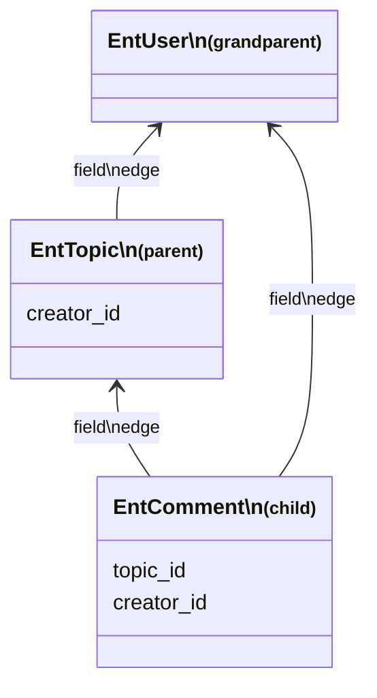
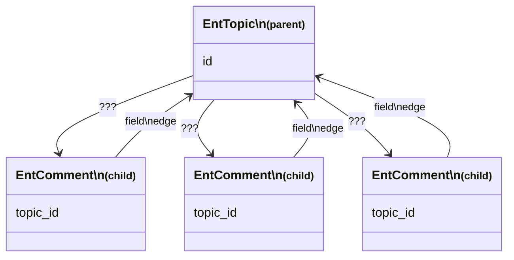

# Ent API: select() by Expression

The previous chapters explained how to load an Ent by its ID: `load*()` API, which is the most basic operation, and it is usually the most common one in the code as well. Now, it comes to some more complicated ways of loading.

TL;DR:

```typescript
const comments = await EntComment.select(
  vc,
  {
    topic_id: "123",
    created_at: { $gte: new Date(Date.now() - 1000 * 3600 * 24) },
  },
  100, // limit
  [{ created_at: "ASC" }] // order by
);
```

## Dry Boring Theory

Below, there will be a bit of theory, fasten your seatbelt.

In graph terms, where each Ent is a **node**, an Ent's field that points to the ID of another Ent represents an **edge**. (Or, in relational databases, people typically use "foreign key" term.) We often refer to it as **field edge**; traversing such edges is typically straightforward: you simply load another Ent by the ID obtained from a field of the current Ent. For example, `EntComment#topic_id` or `EntTopic#creator_id` are field edges.

From a different perspective, traversing a field edge can be seen as "going from a child Ent to a parent Ent" (for example, from `EntComment` to its owning `EntTopic`). In other words, it’s a **child-to-parent traversal**, or a **many-to-one relationship:**



Nothing too new yet, right? Just a regular relational theory so far.

How do we go in the opposite direction, performing a **parent-to-children traversal** in a **one-to-many relationship**?

To accomplish this, the Ent Framework provides (surprise!) a `select()` primitive. It allows you to fetch Ents from the database using any arbitrary expression, including those that specify constraints on which parent Ent's ID the selected Ents should have:

```typescript
const comments = await EntComment.select(
  vc,
  { topic_id: "123" }, // "load all children comments of topic 123"
  100, // limit
  [{ created_at: "ASC" }] // order by
);
```

In production databases with millions of Ents, it's assumed that the relevant database table has the necessary index to run such queries efficiently; in the above example,

```sql
CREATE INDEX ON comments_topic_id_created_at ON comments(topic_id, created_at);
```

Nothing new again. Or there is something?..



Let's think about those `???` on the diagram. To traverse edges in a graph in both directions, the edges must be bi-directional (or, there should be pairs of edges, which is the same). In the graph with bi-directional edges we discussed earlier, the child-to-parent direction of an edge is represented by an "Ent field edge". But what corresponds to `???`, the opposite **parent-to-child direction** of that edge?

This `???`'s is the **automatic database index** (or an index prefix, which is `parent_id` in the example). In fact, as we mentioned above that, without such an index, the queries will just blow up.&#x20;

This distinction between graph edge directions is crucial to understand: for free traversal of the graph, both **field edges** and **indexes** are absolutely essential.

* By defining a DB foreign key on an Ent, you define a field edge, which represents child-to-parent direction in the graph.
* By defining a DB index, you define the opposite end of that edge, representing parent-to-children direction.

Modern database engines are pretty good at managing indexes. You can add them without acquiring write locks on the tables (`CREATE INDEX CONCURRENTLY`), and you can also add more field edges (aka fields with foreign keys) on an existing tables with no downtime, to refer some other Ent from an existing one.

## What About Microsharding and Horizontal Scaling?

The approach described above works straightforwardly when your database is monolithic. Scaling your app introduces more complexity though due to the involvement of microshards in the traversal process.

Luckily, we can still rely on the parent-to-children indices mainly.

When loading children of a parent Ent, the children might be distributed across multiple microshards. A naive way would thus be to just query all microshards using the exact same query (Ent IDs are globally unique) and then merge the results, but of course it would blow up the databases.

Therefore, before the Ent Framework executes the actual SELECT queries in parallel on multiple nodes to merge their results later, it first determines the **minimal set of microshards** that needs to be queried; in the vast majority of cases, this is just **one microshard**. Those mechanisms are known as **Inverses** and **Ent Colocation** correspondingly, and we’ll explore it in detail later.

For now, all you need to know is that there is a magical subsystem in Ent Framework called Inverses which, given a parent ID (e.g. EntTopic ID), returns the list of microshards where the children Ents (e.g. EntComment) may **or may not** reside. This "may not" is important: cross-shard queries are not transactional, so sometimes (rarely), slightly more candidate microshards may be returned. In reality it produces no problems for business logic: the "excess" microshards, when queried, will just return 0 children Ents.

## Query Language

The `select()` API in Ent exposes a simple query language. If a plain object is passed, it combines all the specified field constraints using an AND operation:

```typescript
const comments = await EntComment.select(
  vc,
  {
    topic_id: ["123", "456"],
    created_at: { $gte: new Date(Date.now() - 1000 * 3600 * 24) },
  },
  100, // limit
  [{ created_at: "ASC" }] // order by
);
```

The full list of operations include:

* equality and "one of array element" implicit operators (see examples above)
* logical: `$or`, `$and`, `$not`
* binary: `$lte`, `$lt`, `$gte`, `$gt`
* `$overlap` (useful for array fields, typically backed by a PostgreSQL GIN index)
* `$isDistinctFrom` (for NULL-safe comparisons)
* `$literal` (to run a custom SQL sub-expression)

These operations can be nested in any way, but it's important to ensure that the actual SQL engine uses an appropriate database index for efficiency.

If your project uses microsharding, one of the top-level fields in the `select()` expression must match a parent ID or an array of parent IDs to help the Ent Framework identify the relevant microshards. Notice that we used `topic_id` for this purpose in the example above. There’s no magic here: sometimes, it has to determine which microshards are involved. Alternatively, you can use the special `$shardOfID` operator to explicitly provide this hint in the query.

For illustrative purposes, below is a giant `select()` expression from one of Ent Framework's unit tests. It is generally obvious, how the operations work (as opposed to e.g. Elasticsearch query language BTW):

```typescript
const ents = await EntSome.select(
  vc,
  {
    name: ["aa", "bb"], // matches one of
    some_flag: true,
    $or: [
      { name: "aa" },
      { name: "bb" },
      { url_name: [] }, // will never match
      { url_name: [null, "zzz"] }, // null-safe
    ],
    $and: [
      { name: ["aa", "bb"] },
      { name: { $ne: "kk" } },
      { name: { $isDistinctFrom: "dd" } },
      { url_name: { $isDistinctFrom: null } }, // null-safe !=
      { url_name: { $ne: ["kk", null] } }, // null-safe too
      { url_name: { $ne: [] } }, // will always match
      { $literal: ["? > '2'", "5"] },
      { name: { $lte: "y", $gte: "a" } },
      { $overlap: [id1, id2, id3] } // most likely you want a GIN index here!
    ],
    $not: {
      name: "yy",
      $literal: ["length(name) < ?", 5], // custom SQL expression
    },
    // Optional; it's for the cases when you don't really have a field edge,
    // so Ent Framework can't infer microshards from the query.
    $shardOfID: "12345",
  },
  100,
  [{ name: "ASC" }, { url_name: "DESC" }, { $literal: ["1=?", 2] }]
);
```

For more details, see TypeScript `Where<...>` definition in [types.ts](https://github.com/clickup/ent-framework/blob/main/src/types.ts).

## Batching for select() Calls

As everything in Ent Framework, when multiple `select()` calls are run in parallel, they are batched into one giant SQL `UNION ALL` query.

The following code will produce only one SQL query:

```typescript
await Promise.all([
  EntComment.select(vc, { topic_id: "42" }, 10),
  EntComment.select(vc, { creator_id: "101" }, 20),
]);
```

SQL query produced under the hood (with some simplifications):

```sql
SELECT * FROM topics WHERE topic_id='42'
UNION ALL
SELECT * FROM topics WHERE creator_id='101'
```

Sometimes, `select()` calls are meant to be relatively slow, and we don't want to batch them; instead, we prefer to run them in parallel, in different DB connections. To do so, we can just inject an "event loop spin" barrier:

```typescript
// Never produces a UNION ALL SQL query.
await Promise.all([
  EntComment.select(vc, { topic_id: "42" }, 10),
  new Promise(setImmediate).then(
    async () => EntComment.select(vc, { creator_id: "101" }, 20),
  ),
]);
```
