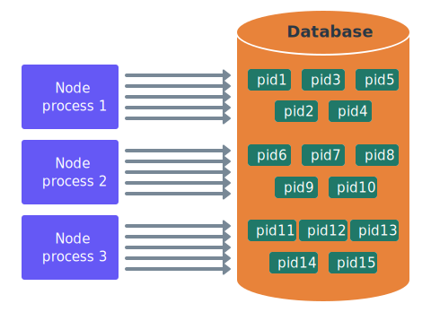
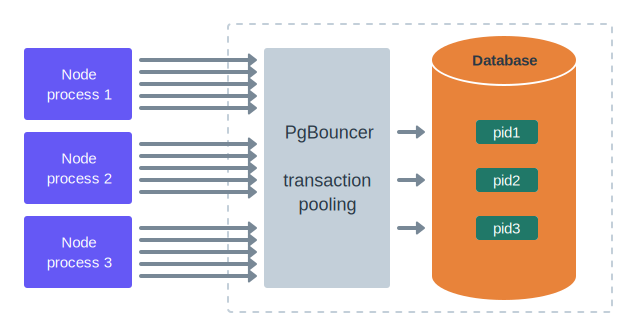

# Connection Pooling

When `min` client option is provided in the [cluster configuration](../getting-started/connect-to-a-database.md), Ent Framework maintains up to this number of established database connections ("pre-warmed"), even when there are no queries coming. This allows for the new queries to execute quickly: establishing a new connectioon is an expensive process that may take tens of milliseconds and involve multiple round-trips to the server (especially when using SSL-encryption).

At the same time, having many persistent connection in some databases is expensive as well. For instance, PostgreSQL architecture implies that there is one independent OS process behind every single active connection. So setting PostgreSQL config's [max\_connections](https://www.postgresql.org/docs/current/runtime-config-connection.html) to a value larger than \~100 (varies depending on the number of CPU cores on the server and available memory) is not the best idea.

## Direct Connections

Imagine you have one database server and 20 Node app processes running in your cluster. If each app opens 5 persistent connections to the database, you'll have 20\*5 = 100 database processes, idle most of the time, which exhausts that 100 cap mentioned above. And it's not even considered a large cluster.

<figure><figcaption></figcaption></figure>

It's obvious that this picture doesn't scale: you can't launch more Node apps in case you experience heavier traffic, because those processes will overload the database by too many connections.

## Connection Pooler

A classical solution for this is to inject a so-called "connection pooler" (like PgBouncer for PostgreSQL).

* It handles thousands of incoming app's connections, so you can have as many Node processes as needed.
* It keeps a small and limited number of open outgoing connections to the database server.
* It receives client queries (transactions)  from the incoming connections, then figure out, is there an "idle" outgoing database connection. If so, it proxies the transaction to that connection; if not, then it waits toll some database connections become available again.

<figure><figcaption></figcaption></figure>

Now, you can have thousands (ane even tens of thousands) persistent incoming connections per database, and if they are mostly idle (which is the case), then it will all work the right way.

Often times, when the database server is installed on a regular machine, people setup the connection pooler (such as PgBouncer) on the same machine, just to protect the database from overloading with the number of connections (processes). If you use AWS RDS or Aurora, then it may make sense to setup PgBouncer on a separate set of the machines (or containers) in the cluster, in the same availability zone as the RDS/Aurora databases. Despite Aurora is more tolerant to the number of incoming connections than vanilla PostgreSQL, it still does not handle tens of thousands of them, so a separate connection pooler is always preferred.

## Ent Framework and PgBouncer

Generally, Ent Framework doesn't care, what you put to the nodes configuration, be it a direct PostgreSQL connection or a reference to some connection pooler like PgBouncer. If you use a pooler, then make sure to:

1. Set it up in "transaction pooling" mode. In this mode, if a transaction is started in some connection, then the pooler makes sure that all of the queries within this transaction are proxied to the same PostgreSQL server connection as the transaction `BEGIN` statement itself.
2. Prefer PgBouncer. This is because PgBouncer sometimes emits its own error codes (related to connections or queries time out, disconnects etc.), which Ent Framework understands in addition to the vanilla PostgreSQL client library error codes. This improves the engine behavior in case it loses a node due to network errors or a restart, and speeds up the master/replica rediscovery process.

