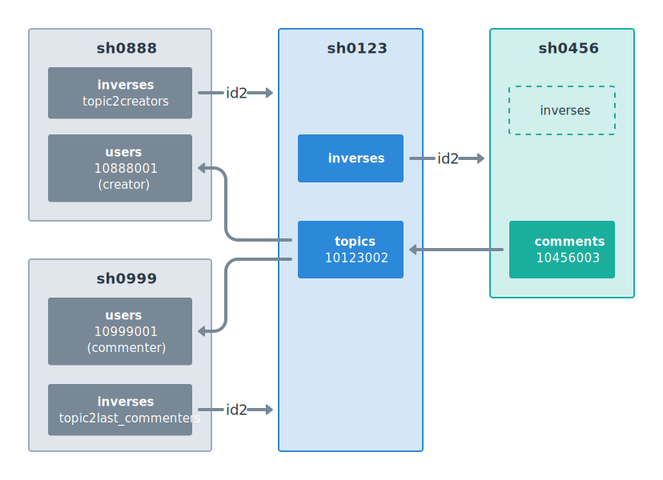

# Inverses, Cross Shard Foreign Keys

We have already touched the topic of inverses and loading Ents across multiple microshards in [ent-api-select-by-expression.md](../getting-started/ent-api-select-by-expression.md "mention") article. We also noted that in many cases, it's better to colocate "related" Ents in one microshard: [shard-affinity-ent-colocation.md](shard-affinity-ent-colocation.md "mention").

Now, it's time to discuss how inverses work in details.

## Ents with Random Shard Affinity

Let's first build a pretty artificial "family" of the Ents (EntUser—EntTopic—EntComment), where each Ent is created in a random shard at insert time. (In real life, you'll likely want most of your Ents to be colocated to their parents, but for the best illustration,  we'll make the opposite assumption).

```typescript
export class EntUser extends BaseEnt(
  cluster, 
  new PgSchema("users", {
    id: { type: ID, autoInsert: "id_gen()" },
    ...
  }),
) {
  static override configure() {
    return new this.Configuration({
      shardAffinity: [],
      ...
    });
  }
}

export class EntTopic extends BaseEnt(
  cluster, 
  new PgSchema("topics", {
    id: { type: ID, autoInsert: "id_gen()" },
    // Reference to parent 1.
    creator_id: { type: ID },
    // Reference to parent 2 (optional).
    last_commenter_id: { type: ID, allowNull: true },
    ...
  }),
) {
  static override configure() {
    return new this.Configuration({
      shardAffinity: [],
      inverses: {
        creator_id: { name: "inverses", type: "topic2creators" },
        last_commenter_id: { name: "inverses", type: "topic2last_commenters" },
      },
      ...
    });
  }
}

export class EntComment extends BaseEnt(
  cluster, 
  new PgSchema("comments", {
    id: { type: ID, autoInsert: "id_gen()" },
    // Reference to parent.
    topic_id: { type: ID },
    ...
  }),
) {
  static override configure() {
    return new this.Configuration({
      shardAffinity: [],
      inverses: {
        topic_id: { name: "inverses", type: "comment2topics" },
      },
      ...
    });
  }
}
```

Notice the following:

1. `shardAffinity=[]` for all of the above Ents. It means that, at insert time, the target microshard will be chosen randomly.
2. There is `inverses` configuration property, which tells Ent Framework, how it can find children Ents located in other microshards than the parent Ents (e.g. how to find all topics related to a particular creator).

## SQL Tables for Inverses

Before we continue, let's look at the tables structure we need to have in **all microshards** of the database.

```sql
-- All of sh0001, sh0002 etc. schemas must have this:
CREATE TABLE users(
  id bigint PRIMARY KEY DEFAULT id_gen(),
  ...
);

CREATE TABLE topics(
  id bigint PRIMARY KEY DEFAULT id_gen(),
  creator_id bigint NOT NULL,
  last_commenter_id bigint,
  ...
);
CREATE INDEX topics_creator_id ON topics(creator_id);
CREATE INDEX topics_last_commenter_id ON topics(last_commenter_id);

CREATE TABLE comments(
  id bigint PRIMARY KEY DEFAULT id_gen(),
  topic_id bigint,
  ...
);
CREATE INDEX comments_topic_id ON comments(topic_id);

-- And the main table for this article...
CREATE TABLE inverses(
  id bigint PRIMARY KEY DEFAULT id_gen(),
  created_at timestamptz NOT NULL DEFAULT now(),
  type varchar(64) NOT NULL,
  id1 bigint,
  id2 bigint,
  UNIQUE(type, id1, id2)
);
```

Tables `users`, `topics` and `comments` are not much special, except that their `*_id` fields are not declared as `FOREIGN KEY`. No surprise: there can be no SQL-enforced foreign keys across microshards, so we just keep the fields being of the regular `bigint` type. We still define indexes for those fields though, for faster selection.

Now, notice the `inverses` table. It is treated by Ent Framework in a special way.

When you e.g. insert an EntTopic row, Ent Framework first chooses the target microshard randomly and then creates a row in `inverses` table in the parent's shard. It then inserts the row to the destination microshard. Thus, Ent Framework remembers, what are the children microshards (encoded in `inverses.id2`) for each parent ID (`inverses.id1`).

## An Example of What's Actually Inserted

Probably the simplest way to understand inverses is to look at a particular example, what's inserted and where when creating the Ents.

Consider the following "family" Ents creation.

```typescript
//
// Remember that we had the following inverses defined for EntTopic:
//   inverses: {
//     creator_id: { name: "inverses", type: "topic2creators" },
//     last_commenter_id: { name: "inverses", type: "topic2last_commenters" },
//   },
//
// And for EntComment:
//   inverses: {
//     topic_id: { name: "inverses", type: "comment2topics" },
//   },
//
const creatorID = await EntUser.insert(vc, { ... });
const commenterID = await EntUser.insert(vc, { ... });
const topicID = await EntTopic.insert(vc, {
  creator_id: creatorID,
  last_commenter_id: commenterID,
  ...
});
const commentID = await EntComment.insert(vc, {
  topic_id: topicID,
  ...
});
```

Internally, Ent Framework will run the following SQL queries (pseudo-code):

```sql
-- Microshard for the user is randomly chosen as sh0888.
INSERT INTO sh0888.users(id) VALUES(id_gen())
  RETURNING id INTO $creatorID;

-- Microshard for anotjer user is randomly chosen as sh0999.
INSERT INTO sh0999.users(id) VALUES(id_gen())
  RETURNING id INTO $commenterID;

-- Microshard for the topic is randomly chosen as sh0123.
$topicID := sh0123.id_gen();
INSERT INTO sh0888.inverses(type, id1, id2) VALUES
  ('topic2creators', $creatorID, $topicID);
INSERT INTO sh0999.inverses(type, id1, id2) VALUES
  ('topic2last_commenters', $commenterID, $topicID);
INSERT INTO sh0123.topics(id, creator_id, last_commenter_id) VALUES
  ($topicID, $creatorID, $commenterID);

-- Microshard for the comment is randomly chosen as sh0456.
$commentID := sh0456.id_gen();
INSERT INTO sh0123.inverses(type, id1, id2) VALUES
  ('comment2topics', $topicID, $commentID);
INSERT INTO sh0456.comments(id, topic_id) VALUES
  ($commentID, $topicID);
```

Notice that, because of `{ name: "inverses", type: "topic2creators" }` inverse specifier, Ent Framework knows that the inverses table name is `inverses`, and the value of the `type` field there is `"topic2creators"`.  You can choose your own values for both of those options: the above example is just a convention.

<figure><figcaption></figcaption></figure>

Inverses are always inserted to the parent's shard (not to the child's shard) and **before** the actual row (`id_gen()` defined in `autoInsert` option is called in a separate database query). This guarantees that there will be no situation when there is a row in some shard, but its corresponding inverse does not exist in another shard. I.e. there are always **not less** inverses in the cluster than the Ent rows.

And to maintain the "not less" invariant, when an Ent is deleted, the corresponding inverses are deleted **after** it (not before). So even if the inverse deletion query fails, it will still be okay for us: we'll just have a "hanging inverse".

As a result, the following rows will appear in the database tables:

```
sh0888 - creator's shard:
- users(id:10888001)
- inverses(type:topic2creators  id1:10888001    id2:10123002)
                                    $creatorID      $topicID
sh0999 - commenter's shard:
- users(id:10999001)
- inverses(type:topic2last_commenters  id1:10999001      id2:10123002)
                                           $commenterID      $topicID
sh0123 - topic's shard:
- topics(id:10123002 creator_id:10888001 last_commenter_id:10999001)
- inverses(type:comment2topics  id1:10123002  id2:10456003)
                                    $topicID      $commentID
sh0456 - comment's shard:
- comments(id:10456003 topic_id:10123002)
```

## Children Ent Microshard Hints

So, inverses allow Ent Framework to find all children Ents related to a particular parent ID, like all topics by a last commenter ID:

```typescript
const topics = await EntTopic.select(
  vc,
  { last_commentet_id: "10999001" },
  100,
);
```

This would send the following SQL queries to the database (pseudo-code):

```sql
SELECT id2 FROM sh0999.inverses
  WHERE type='topic2last_commenters' AND id1='10999001'
  INTO $id2s;

FOR $shard IN shards_from_ids($id2s) LOOP
  SELECT * FROM $shard.topics
    WHERE last_commenter_id='10999001'
    LIMIT 100;
END LOOP;
```

(Of curse, as everything in Ent Framework, the above will be batched into compound SQL queries when multiple `select()` calls are happening in parallel.)

Notice that, despite inverses hold the full ID of the child Ent in `id2` field, only the microshard number from `id2` is used in Ent Framework logic (see `shard_from_id()` in the above pseudo-code). I.e. `id2` is used to get "covering hints" about what microshards should be queried when loading the data.

This is a really powerful approach. It solves the problem of cross-shard consistency. Since we have not less inverses than the children rows, Ent Framework just collects all unique microshards from those inverses `id2` fields and then queries them using a regular SELECT. If there were some hanging (excess) inverses in the database, it is not a big deal: the engine will just query a little bit more microshards than it needs to, but the SELECTs from those extra microshards will just come empty.

It makes sense to delete the hanging inverses in background from time to time ("inverses fixer" infra), since they may accumulate slowly. Currently, Ent Framework doesn't have any logic to help with this, but in the future, such functionality may appear. Since inverses are treated as just covering hints, not cleaning them up is generally fine.

## Unique Keys

When `shardAffinity=[]`, the microshard is chosen randomly at insert time.

But if the Ent has a unique key defined in its schema, _this randomness is not absolute_. The seed of the random number generator is assigned based on the value of the Ent's unique key, so all `insert()` calls with the same unique key will essentially choose the same microshard for insertion.

Let's consider an example.

```typescript
export class EntTopic extends BaseEnt(
  cluster, 
  new PgSchema(
    "topics",
    {
      id: { type: ID, autoInsert: "id_gen()" },
      creator_id: { type: ID },
      slug: { type: String },
    },
    ["slug"], // <-- unique key
  ),
) {
  static override configure() {
    return new this.Configuration({
      shardAffinity: [],
      ...
    });
  }
}
```

Imagine you have a web server route which creates a new topic with a particular slug:

```typescript
app.post("/topics", async (req, res) => {
  const topicID = await EntTopic.insert(req.vc, {
    creator_id: req.vc.principal,
    slug: String(req.body.slug),
  });
});
```

The user clicks the button in the browser, and the topic creation POST request is sent to the server.

Now imagine that there is some network issue happened between the backend and the database after the INSERT query is sent, but before the response is received. Or the database is overloaded, so it accepted the INSERT query, but failed to respond within the allocated time. In this case, there will be a "non-idempotent query timeout": the backend will see the error, but it will not know, whether the INSERT query succeeded (and thus, the topic is created), or it failed internally.

In case of an error, the user will likely press the button again, and it will cause another POST request to insert the topic with the same slug.

If we chose the microshard trully randomly, then the 2nd INSERT would create the topic row in another shard, and there would be a possiblilty to create 2 topics with the same slug in 2 different microshard. This would be really bad: we would violate the unique key constraint across shards (there is nothing in inverses engine preventing from creating duplicates).

This is why the microshard is chosen pseudo-randomly, based on the Ent's unique key (it it is defined). Thus, an attempt to create a duplicated Ent would fail with a unique key constraint error, and the app would be able to handle it. In the above example, `insert()` would've thrown an error, but you could use `insertIfNotExists()` call which would just return null; see [ent-api-insert.md](../getting-started/ent-api-insert.md "mention").
