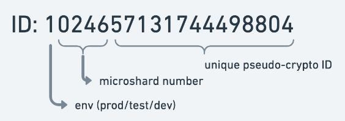

# Locating a Shard

To enable microshardig support, we first need to configure the instance of `Cluster` class:

```typescript
export const cluster = new Cluster({
  islands: () => [
    {
      no: 0,
      nodes: [
        { name: "abc-instance-1", host: "...", ... },
        { name: "abc-instance-2", host: "...", ... },
      ],
    },
    {
      no: 1,
      nodes: [
        { name: "abc-instance-3", host: "...", ... },
        { name: "abc-instance-4", host: "...", ... },
      ],
    },
  ],
  shards: {
    nameFormat: "sh%04d",
    discoverQuery:
      "SELECT nspname FROM pg_namespace WHERE nspname ~ 'sh[0-9]+'",
  },
  ...,
});
```

## Shards Discovery

Notice the `shards` configuration property above.

* `nameFormat`: this sprintf-style template defines, how Ent Framework should build the microshard schema name when it knows the microshard number. In our case, the schema names will look like `sh0123` or `sh0000`, and there will be up to 10000 microshards allowed.
* `discoverQuery`: Ent Framework will run this query on all islands from time to time to figure out, what shards are located where. It will also run this query immediately in several conditions, like "table not found" error (which may mean that a microshard has just been moved from one island to another, so Ent Framework needs to rediscover).

There is also pg-microsharding library which allows you to manipulate microshard schemas: create them, activate, move and rebalance microshards across islands. When this library is used, you can utilize `SELECT * FROM unnest(microsharding.list_active_shards())` as a value for `discoverQuery`.

As of the islands in the cliuster, just enumerate them and their nodes. Ent Framework will figure out, what nodes are masters and whan nodes are replicas. You can also change the list of islands and nodes in real-time, without restarting the app: Ent Framework is smart enough to pick up the changes if `islands` callback returns a different value (it is called from time to time).

## Format of IDs

Assume we have the following call:

```typescript
const user = EntUser.loadX(vc, id);
```

When users are distributed across multiple microshards, Ent Framework decides, which microshard should it query the data from. The decision is made based on the ID prefix:

<figure><figcaption></figcaption></figure>

To use the default microshard location strategy, there is a convention on ID format, it must consist of 3 parts:

* `"1"` (Environment Number): you may want to make your IDs globally unique across the entire world, so all IDs in dev environment will start from e.g. 1, IDs in staging with 2, and IDs in production with 3.
* `"0246"` (Shard Number): this is where the microshard number reside in the ID structure. In the code, it is also referred as "Shard No".
* `"57131744498804"` (Entropy): a "never-repeating random-looking" part of the ID. It may not necessarily be random (other strategies are "auto-incremental" and "timestamp-based"), i.e. the concrete generation algorithm it's up to the library which generates the new IDs.

Ent ID (and thus, its microshard number) is determined once, at the time when the Ent is inserted. Typically, each microshard schema has its own function that build the IDs, fills the environment and shard number, generates the "never-repeating random-looking" part:

```typescript
const schema = new PgSchema(
  "users",
  {
    id: { type: ID, autoInsert: "id_gen()" },
    email: { type: String },
  },
  ["email"]
);
```

Here, we use `id_gen()` function from pg-id library, which by default generates the IDs in the format we mentioned above:

```
EssssRRRRRRRRRRRRRR
 ^   ^^^^^^^^^^^^^^
 4   14
```

## Stored Functions in pg-id Library

The complete list of `id_gen*()` functions in pg-id library are:

* `id_gen()`: generates next globally-unique randomly-looking id. The main idea is to not let external people infer the rate at which the ids are generated, even when they look at some ids sample. The function implicitly uses a sequence to get the information about the next available number, and then uses [Feistel cipher](https://en.wikipedia.org/wiki/Feistel_cipher) to generate a randomly-looking non-repeating ID based off it.
* `id_gen_timestampic()`: similar to `id_gen()`, but instead of generating randomly looking ids, prepends the "sequence" part of the id with the current timestamp.
* `id_gen_monotonic()`: the simplest and fastest function among the above: generates next globally-unique monotonic id, without using any timestamps as a prefix. Monotonic ids are more friendly to heavy INSERTs since they maximize the chance for btree index to reuse the newly created leaf pages.
